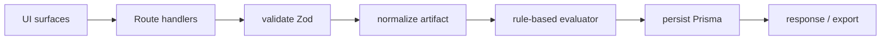

# Architecture — Instructional Integrity Studio

## Overview

Next.js App Router application implementing the Cognitive Safety evaluation pipeline: **artifact intake → normalization → rubric evaluation → evidence attachment → failure classification → persistence → reporting**.

## Module map (§13)

| Module path | Concern |
|-------------|---------|
| `lib/artifacts/*` | Intake validation, sanitization, normalization |
| `lib/rubric/*` | Rubric registry and dimension definitions |
| `lib/evaluator/*` | Evaluator interface, rule-based implementation, verdict logic |
| `lib/evidence/*` | Evidence extraction hook (evidence payloads produced in evaluator for MVP) |
| `lib/persistence/*` | Prisma data access |
| `lib/reporting/*` | JSON/Markdown export builders |
| `lib/run-history-service/*` | History query surface |
| `lib/session/*` | Anonymous session cookie resolution |
| `lib/validation/*` | Zod schemas for API payloads |
| `components/*` | UI surfaces |

## Data flow

## Evaluator boundary (§13.4)

`Evaluator` interface in `lib/evaluator/evaluatorInterface.ts`. MVP implementation: `rule-based-text-evaluator`.
